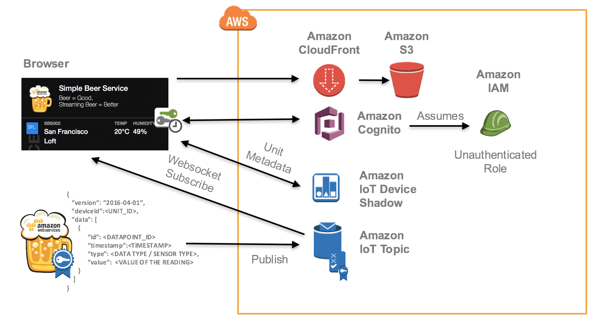

# Simple Beer Service v5.0

Simple Beer Service is a cloud-connected kegerator that sends sensor data (beer flow, temperature, humidity, sound levels and proximity) to AWS. Simple Beer Service kegerators publish sensor data collected by an IoT device to an Amazon IoT Device Gateway. The Amazon IoT Rule Engine is used to invoke downstream actions in AWS, such as publishing to an Amazon Kinesis Firehose or an Amazon DynamoDB table.

The data visualizations are delivered through a static web application dashboard that opens a web socket connection to the same Amazon IoT Topic, providing a near real-time display of the sensor data. The web application is stored in Amazon S3 and delivered through Amazon’s content delivery network, Amazon CloudFront.



For a more step-by-step instruction guide through the AWS console, see the [bootcamp branch](http://github.com/awslabs/simplebeerservice/tree/bootcamp) of this repository.

## Hardware

You can select the components that you feel would be best for your unit. However, the three major components you will need are:

- [Kegerator](https://www.amazon.com/s?rh=n%3A2686378011%2Cp_4%3AKegco)
- 3D Printed Head Unit. *See Below*
- [Intel Edison and AWS IoT Starter Kit](https://www.amazon.com/dp/B0168KU5FK?psc=1) or any supported [Johnny-five platform](http://johnny-five.io/platform-support/)

[Click here for the full bill of materials.](sbs-build-of-materials.csv)

### The Head Unit

The 3D printable .STL files are available in the stl folder of this repository. You can print these at your favourite 3D printing studio. [3Dhubs.com](http://3dhubs.com/) is a great place to submit your order and find a local printer.

There is also a slot in the front of the head unit for a clear face plate. [Ponoko.com](http://www.ponoko.com/) is a great place to get a face plate designed and laser etched. Here is the material that we recommend:
- Size: **195mm x 80mm**
- Acrylic Clear - Abrasion Resistant 0.118 inches - 15.118 inches x 15.118 inches. [Link](http://www.ponoko.com/make-and-sell/show-material/583-acrylic-clear-abrasion-resistant)

Once you get the prints back, you will need a few screws to tie everything together.

### The Device

> **Note:** This instruction guide will focus on the Intel Edison, however, Johnny-Five supports many platforms. If you are using another platform, simply change the `io: new Edison()` option when instantiating a board object in the *sbs.js* device code.

1. Download the Intel Edison installer and the latest Yocto image. [Intel Downloads](https://software.intel.com/en-us/iot/hardware/edison/downloads).
2. Run the installer. There are three steps here. Flash the image, set up root user credentials and setup WiFi. **Save the IP Address and the SSH credentials to be used later**.
3. Ensure that you are on the same network as your device and SSH into the device. You can SSH into the device using *Terminal on a Mac / Linux or Putty on a Windows*.

  ```
  ssh root@<IP_ADDRESS>
  ```

4. Install Forever (to keep your SBS application running).

  ```
  npm install -g forever
  ```

5. Create a new directory for your code.

  ```
  mkdir /opt/sbs/
  ```

**Before moving forward, finish the software / AWS environment setup and come back. This will enable you to create your certificates and customize the application before copying the files and setting up auto-start.**

5. Open the file **device/device.json**. Modify the file to fit your environment. In particular, make sure that the *components* json object points to the locations where all of your sensors are plugged in.
6. From another terminal / command line window, copy the files in the device folder over to your device.

  ```
  cd device
  scp -r ./ root@<IP_ADDRESS>:/opt/sbs/
  ```

7. Go back to the SSH session. Install the required libraries. This may take a few minutes.

  ```
  cd /opt/sbs/
  npm install
  ```

8. Create an autostart script.

  ```
  nano /etc/init.d/startsbs.sh

  <OPEN NANO EDITOR>

  #!/bin/bash
  forever start -a -l /dev/null /opt/sbs/sbs.js

  <CONTROL O | write the changes>
  <CONTROL X | exit>
  ```

9. Add the start script to the boot routine:

  ```
  chmod +x /etc/init.d/startsbs.sh
  update-rc.d startsbs.sh defaults
  ln –s /etc/init.d/startsbs.sh /etc/rc3.d/S99startsbs.sh
  ```

## Software

- Install the [AWS CLI](https://aws.amazon.com/cli/).
- Install [version 5.X of Node.JS](https://nodejs.org/dist/latest-v5.x/).

Install the [Serverless Framework](http://serverless.com), [Yeoman](http://yeoman.io), [Bower](http://bower.io) and [Gulp](http://gulpjs.com). You can do this all with a single command:

```
npm install -g serverless yo bower gulp
```

> **Note:** You may need to run "sudo" to install these as an administrator.

### AWS Environment

1. Create the AWS IoT thing.

  ```
  aws iot create-thing --thing-name <YOUR_UNIT_ID>
  ```

2. Create a new file titled *iotpolicy.json*.

  ```json
  {
      "Version": "2012-10-17",
      "Statement": [
          {
              "Effect": "Allow",
              "Action": [
                  "iot:Connect"
              ],
              "Resource": [
                  "*"
              ]
          },
          {
              "Effect": "Allow",
              "Action": [
                  "iot:Publish"
              ],
              "Resource": [
                  "arn:aws:iot:<REGION>:<ACCOUNT_NUMBER>:topic/<TOPIC_NAME>"
              ]
          }
      ]
  }
  ```

3. Create the AWS IoT policy.

  ```
  aws iot create-policy --policy-name <POLICY_NAME> --policy-document file://iotpolicy.json
  ```

4. Create the certificates and store them in the **device/cert** directory.

  ```
  mkdir device/cert
  aws iot create-keys-and-certificate --set-as-active --certificate-pem-outfile device/cert/certificate.pem.crt --public-key-outfile device/cert/public.pem.key --private-key-outfile device/cert/private.pem.key
  ```
  > You will also need one more file, the VeriSign root certificate. [Download that certificate here](https://www.symantec.com/content/en/us/enterprise/verisign/roots/VeriSign-Class%203-Public-Primary-Certification-Authority-G5.pem) and save it to the same cert directory. Name it **root.pem.crt**.

5. Copy the Certificate ARN produced in the previous command. Associate the policy and thing with the certificate:

  ```
  aws iot attach-principal-policy --policy-name <POLICY_NAME> --principal arn:aws:iot:<REGION>:<ACCOUNT>:cert/<CERTID>
  aws iot attach-thing-principal --thing-name <THING_NAME> --principal arn:aws:iot:<REGION>:<ACCOUNT>:cert/<CERTID>
  ```

6. Create a new Cognito Identity Pool and copy the Identity Pool ID to a safe place for later (in the ). It is easiest to do this from the AWS console. [Follow the directions here](http://docs.aws.amazon.com/cognito/latest/developerguide/identity-pools.html).
7. Create a new unauth policy, name it **unauth_policy.json** and associate it with the unauthenticated role.

  ```json
  {
      "Version": "2012-10-17",
      "Statement": [
          {
              "Effect": "Allow",
              "Action": [
                  "iot:Connect",
                  "iot:Receive"
              ],
              "Resource": "*"
          },
          {
            "Effect": "Allow",
            "Action": "iot:GetThingShadow",
            "Resource": [
              "arn:aws:iot:<REGION>:<REPLACE_WITH_ACCOUNT_NUMBER>:thing/<SBS_THING_NAME>"
            ]
          },
          {
              "Effect": "Allow",
              "Action": "iot:Subscribe",
              "Resource": [
                  "arn:aws:iot:<REGION>:<REPLACE_WITH_ACCOUNT_NUMBER>:topicfilter/<TOPIC_NAME>/*"
              ]
          }
      ]
  }
  ```

8. Create the role and apply the policy.

### Serverless Project

This application uses the Serverless Framework. You can initialize your project with the following command:

> **Important!!** Simple Beer Service app assumes that you have a domain to use with your project. If you do not have a hosted zone setup, create one now.
```
aws route53 create-hosted-zone --name <domainname.com>
```

```
cd simplebeerservice
npm install
sls variables set
  name: domain
  value: <YOUR_DOMAIN>
  type: Common
sls project init
```

This will create a new set of resources for your SBS application.

> **Note:** you will need to have the CLI installed with a valid AWS profile to start using Serverless.

### Web Application

For this section, we will be working out of the **client** directory. This is where all of the files we need to build out the static web application. First, run this command to change the directory and install the required libraries.

```
cd client
npm install
bower install
```

Before we get going, here is a quick intro to a tool called **Gulp**. Gulp is a task manager for Node.js applications. It enables us to wire up commands that will perform common tasks. Here are a few we will use today. Go ahead and try them out!

> ```
gulp serve
```
> This command will run a local webserver that is listening for any changes to your app directory. If there are an file changes, it will reload the local running web application. This is great for development, as you can see changes live as you update the code.
> ```
gulp build
```
> This command will package up all of the files you need for your static site and write them into your **/dist/** folder. This is the folder that serverless is using when it publishes your S3 static files.
> ```
gulp test
```
> This command will run the unit tests defined in the **/test/** folder. For this project, we have not defined any unit test.

Awesome. Now you know how to work with Gulp! Next, let's open up **app/scripts/main.js** in Atom and copy and paste your identity pool ID from Cognito. You can get this from the Cognito console.

1. Find the variable **IDENTITY_POOL_ID** and update the variable with your identity pool.
2. Go back to the command line and type:

  ```
  gulp build
  ```

3. Change the directory back to the main serverless directory and type:

  ```
  sls client deploy
  ```

4. Serverless will output an S3 link. Put that S3 link in your browser and check out your static site!!
