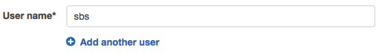

# Simple Beer Service Developer Bootcamp

Welcome to the Simple Beer Service developer bootcamp! I am excited to onboard *you* as a new SBS developer. That's right, after today - you are a part of the team. You will learn:

- How to collaborate on a serverless project.
- How to build a static Amazon S3 website, fronted by Amazon CloudFront.
- How to leverage AWS IoT to connect a device to the cloud.
- How to collect and stream data into downstream AWS services.

## Getting your environment setup.

### Prerequisites

You will need the following tools to get started today.

1. An AWS account, of course! [Create one today!](https://aws.amazon.com/getting-started/)
2. A GitHub account. Need one? [Create one today!](https://github.com/join)
3. The version control system Git. [Install here.](https://git-scm.com/book/en/v2/Getting-Started-Installing-Git)
4. Recent version of Node.js installed. [Download here.](https://nodejs.org/en/download/)
5. A text editor.. I recommend Atom. [Download here.](https://atom.io/)

That's it for the prereqs! Now, let's install all the pre-reqs setup.

### Installing a few crucial node packages.

There are two node packages we need to install globally, so that we can use them no matter what project we are working on. To do this, run the following command:

```
npm install -g serverless@0.5.6 yo bower gulp
```

> **What are these?!**
> Serverless is the framework we will use to build the scaffolding for the entire project. YO, or Yeoman, is a popular static web application generator that we will use to build out the static S3 website.

### Setting up AWS CLI tools

For this bootcamp, you will need to have the AWS CLI tools installed.

#### Windows:

Download and install the CLI here:
- [Windows 64 bit](https://s3.amazonaws.com/aws-cli/AWSCLI64.msi)
- [Windows 32 bit](https://s3.amazonaws.com/aws-cli/AWSCLI32.msi)

#### Mac and Linux:

Ensure that Python is installed. Once python is installed, run this command:

```
sudo pip install awscli
```

If on OSX El Capitan, run this command:

```
sudo pip install awscli --ignore-installed six
```
> **Note:** You will need to have pip installed in order to run this command. To install pip, follow the instructions [here](https://pip.pypa.io/en/stable/installing/).

#### Configure the CLI:

First, sign in to the AWS.
Under **My Account** drop down menu,  
Choose **AWS Management Console**.  
Find the section: **Security & Identity**,  
Choose **Identity & Access Management** (aka IAM)  

Now create a new IAM user as follows:

1. Create a new user by clicking **Create User** in the *IAM Console*.


2. Name your user accordingly. Ensure the *Generate an access key* is checked.


3. Save the access keys to your computer.


4. Next, press **Close** and click on the newly created user. Click on the **Permissions** tab.


5. For today's lab, we will give this user *Administrator Access*. Click **Attach Policy** in the section *Managed Policies*. This will lead you to a new screen. Start typing *AdministratorAcc* and it will filter to the **AdministratorAccess** managed policy. Click on the checkbox and press **Attach Policy**


> **Note**: The Administrator Access policy gives virtually unlimited privileges within your AWS account. Today, you will have the choice to build out custom components to your SBS application, which could use any service. For this reason, we are giving broad access to you as a developer. However, it would be advised to review this permission, following [IAM Best Practices](http://docs.aws.amazon.com/IAM/latest/UserGuide/best-practices.html).  

Now that you have an IAM user and the CLI is installed, you can configure the CLI by using this command:

```
aws configure
```

It will prompt you for an Access Key and Secret Key that you generated above. Copy and paste those in.

### Cloning the repository and installing npm (Node Package Manager) libraries:

First, you will need to clone this project directory. It will have everything you need to be a rockstar Simple Beer Service developer. Run the following command. Open up **Terminal** on a mac, **Bash Shell** on Linux, or the **Command Prompt** on Windows.

```
cd <path/to/my/project/directory>
git clone https://github.com/awslabs/simplebeerservice.git
```

> **Note:** Replace *<path/to/my/project/directory>* with your actual directory you want to run this in.

This will clone the **simplebeerservice** code. Now, switch to the bootcamp branch. This will have all of the files you need for this bootcamp:

```
cd simplebeerservice
git checkout bootcamp
```

Next, run the following commands in your new directory.

```
npm install
cd client
npm install
bower install
cd ../
cd device
npm install
```
> **What's going on here?**

>npm stands for *Node Package Manager*. There is a file in each directory titled *package.json*. Go ahead, open it up - I know you are curious!! In there you will see some meta data about the project. You will also see a list of dependencies. These are node modules that people have built which we are using within our app. A good example is the aws-iot-device-sdk module. When you run npm install, it simply goes through the list and installs all of the modules that are being used in this application. Since we have three components (Serverless Project, Device Code and the Client S3 code, we need to do this three times.)

> **How about bower, what's that?**

>Bower is similar to npm, in that is a package manager - however, it is geared towards client-side modules that will be included when you copy your static web application files to S3. The npm installs includes development scripts that you will use locally, but may not be packaged with the application. The bower installed modules will be packaged with the application and shipped to S3 when you deploy.

**Congrats! You are done setting up your environment**

## Serverless Framework and You

Now that we have all of the packages installed, let's launch our Serverless Environment.

First, lets see all of the commands we can run. Type the following commands:

```
cd <path/to/simplebeerservice>
serverless
```


Next, let's initialize our project. For the rest of the bootcamp, we can use the shorthand for serverless, **sls**. Run the following command:

```
sls project init
```

> **Note:** Replace *<path/to/simplebeerservice>* with your actual root directory of the bootcamp files.

The Serverless framework will now bring you through a wizard to setup your environment. For stage, type in your name.


This will now launch a CloudFormation template that will include all of the resources you need. This will take a while. Let's grab a coffee, it's time for a break.


> **What's in the CloudFormation template??**

>Check it out! Open up s-resources-cf.json. In here is the cloudformation template that Serverless runs when you init a new project, create a new stage or update the resources associated with your project. In this project we have:
- S3 bucket for web files.
- Logging bucket for use later.

**Congrats! You have successfully setup your Serverless enviroment.**

## Setup AWS IoT

So, we have our environment all setup, let's create the resources we need within AWS IoT so we can start sending some data.

1. Open the AWS IoT Console.
2. Click **Create Resource** on the top section of the console page.

3. Click the **Create Thing** box. Name the thing and press the **Create** button.

4. Click the **Create Certificates** box. Check the box *Activate* and then press the **1-click certificates** button.

5. Click on each link to download the **certificate**, **private key**, and **public key**.
> **Important!!**  
> From the command line in your project directory:  `mkdir ./device/certs`  
Now save these certificates to the **simplebeerservice/device/certs** folder in your project directory.  
You will also need one more file, the VeriSign root certificate. [Download that certificate here](https://www.symantec.com/content/en/us/enterprise/verisign/roots/VeriSign-Class%203-Public-Primary-Certification-Authority-G5.pem) and save it to the same certs directory.

6. Click the **Create Policy** box. Allow access to all of IoT for this demo, but selecting **iot:\*** and **\***.

7. Make sure to click on the **Create** button at the bottom.

8. Attach the policy and thing to the certificate, by clicking the *checkbox* on the certificate and the respective links in the dropdown menu **Actions**.


**Congratulations! You can now publish to AWS IoT!**

## Creating the Cognito Identity Pool

For the subscribing web application, we will be creating a Cognito Identity Pool to authenticate and authorize the end user to get data from our endpoint.

1. Open the **Amazon Cognito** Console.
2. Click **Manage Federated Identities**

> **What is Cognito User Pools?**
> There are two flavours of Cognito. User Pools enables you to create and manage your own directory of users for your application. Federated Identities leverages an external indentity provider like Sign-in with Amazon, Facebook Login, Sign-in with Google, Twitter or any OpenID compatible directory.

3. Click **Create new identity pool**. Name your identity pool and check the box *Enable access to unauthenticated identities*.

4. Click the dropdown for **Authentication Providers**. Note the different options you have here. You could link up a *Cognito User Pool*, or use one of the popular identity providers mentioned. For this bootcamp, we will not need to set this up.
5. Press **Create Pool**.
6. Next, it will bring us to a screen where we can setup the IAM roles that will be assumed by both an *Unauthenticated User* and an *Authenticated User*. Look at the policy documents to see how they are structured. Then press **Allow**.
7. The final step is to give permission to an *Unauthenticated User* to subscribe to our AWS IoT Topic. To do this, click back to the list of AWS Services and open the **AWS Identity & Access Management Console**.
8. On the left menu, click **Roles**.
9. You will see all of your roles here. There is one role titled **Cognito_<YOUR_APP_NAME>UnauthRole**. Click on this role.
10. Under *Inline Policies*, press **Create Role Policy** to create a new inline IAM policy.

11. Select the box **Custom Policy** and press **Select**.

12. Name the policy and copy and paste the following JSON text. **Remember to replace <REPLACE_WITH_ACCOUNT_NUMBER> with your actual account number**.

```json
{
    "Version": "2012-10-17",
    "Statement": [
        {
            "Effect": "Allow",
            "Action": [
                "iot:Connect",
                "iot:Receive"
            ],
            "Resource": "*"
        },
        {
            "Effect": "Allow",
            "Action": "iot:Subscribe",
            "Resource": [
                "arn:aws:iot:<REGION>:<REPLACE_WITH_ACCOUNT_NUMBER>:topicfilter/sbs/*"
            ]
        }
    ]
}
```

> **Note:** Replace *<REPLACE_WITH_ACCOUNT_NUMBER>* with your actual account number and *<REGION>* with the region you are using.

13. Press **Apply Policy** and you are done!

**Congratulations! You have successfully created your Cognito Identity Pool**

## Code development.

### The Publisher

OK. We are just crusing along! Now, open up **device/sbs-simulator.js** in your favourite text editor. This application will send data to the *AWS IoT Device Gateway* and simulate a running Simple Beer Service unit.

In the first section of the code, you will notice the following code block:

```javascript
var device = awsIot.device({
    keyPath: "cert/private.pem.key",
    certPath: "cert/certificate.pem.crt",
    caPath: "cert/root.pem.crt",
    clientId: unitID,
    region: "us-east-1"
});
```

Update these fields to point to the files that you downloaded above and the region you selected.

Now, let's run it and test it out!

```
cd <path/to/simplebeerservice/device>
node sbs-simulator.js
```

You should see successful post messages.

> Not seeing this? Raise your hand and we can help you out.

While this application is running, to see if it is actually coming into AWS IoT, let's check out the MQTT Client in the AWS IoT Console.

1. Open the AWS IoT Console.
2. Click on **MQTT Client**. Type in *test* into the Client ID field and press **Connect**

3. Click on **Subscribe to Topic**. Type in *sbs/#* in the topic name field and press **Subscribe**.


You now should see messages flowing in here!

> Not seeing this? Raise your hand and we can help you out.

### The Subscriber

For this section, we will be working out of the **client** directory. This is where all of the files we need to build out the static web application. First, run this command to change the directory:

```
cd <path/to/simplebeerservice/client>
```

Before we get going, here is a quick intro to a tool called **Gulp**. Gulp is a task manager for Node.js applications. It enables us to wire up commands that will perform common tasks. Here are a few we will use today. Go ahead and try them out!

> ```
gulp serve
```
> This command will run a local webserver that is listening for any changes to your app directory. If there are an file changes, it will reload the local running web application. This is great for development, as you can see changes live as you update the code.
> ```
gulp build
```
> This command will package up all of the files you need for your static site and write them into your **/dist/** folder. This is the folder that serverless is using when it publishes your S3 static files.
> ```
gulp test
```
> This command will run the unit tests defined in the **/test/** folder. For this project, we have not defined any unit test.

Awesome. Now you know how to work with Gulp! Next, let's open up **app/scripts/main.js** in Atom and copy and paste your identity pool ID from Cognito. You can get this from the Cognito console.

1. Find the variable **IDENTITY_POOL_ID** and update the variable with your identity pool.
2. Go back to the command line and type:
```
gulp build
```
3. Change the directory back to the main serverless directory and type:
```
sls client deploy
```
4. Serverless will output an S3 link. Put that S3 link in your browser and check out your static site!!

## Bringing it all together

Now, run both the publisher script as well as have a browser window open and pointing at the S3 website. Watch as data flows in!

## Next steps

Now is the **Choose Your Own Adventure** portion of the bootcamp. For the remainder of the afternoon, we will hack away.

Here are a few to select from:

### Setup an AWS IoT Rule
There are many downstream AWS services you can setup as an *Action* for an AWS IoT rule. Here are the set of actions you can apply to an AWS IoT Rule:

- **cloudwatchAlarm** to change a CloudWatch alarm.
- **cloudwatchMetric** to capture a CloudWatch metric.
- **dynamoDB** to write data to a DynamoDB database.
- **elasticsearch** to write data to a Amazon Elasticsearch Service domain.
- **kinesis** to write data to a Amazon Kinesis stream.
- **lambda** to invoke a Lambda function.
- **s3** to write data to a Amazon S3 bucket.
- **sns** to write data as a push notification.
- **firehose** to write data to an Amazon Kinesis Firehose stream.
- **sqs** to write data to an SQS queue.
- **republish** to republish the message on another MQTT topic.

[Click here to learn how to setup an IoT Rule](http://docs.aws.amazon.com/iot/latest/developerguide/iot-rule-actions.html)

The few recommended ones are:

- Create an SNS Topic, [subscribe your email to the SNS topic](http://docs.aws.amazon.com/sns/latest/dg/SubscribeTopic.html). Then, create an IoT rule that publishes data to the SNS topic. You should receive emails when a new message is published to your IoT Topic.
- Create an [Amazon Kinesis Firehose to write all of the data to S3](http://docs.aws.amazon.com/firehose/latest/dev/basic-create.html#console-to-s3). Then, create an IoT rule that publishes all data coming from an IoT topic into the firehose.
- Create a Lambda function that transforms the data. Print the data in your function and [see the outcome through CloudWatch monitoring](http://docs.aws.amazon.com/lambda/latest/dg/monitoring-functions-logs.html).

### Setup an Edison
Join a team of fellow developers and setup an Intel Edison (available from the instructor.)

[Intel Edison Getting Started Guide](https://software.intel.com/en-us/iot/library/edison-getting-started).

### Create a CloudFront Distribution
Right now, we are serving the web application directly through S3. To reach a wide global audience and provide a good user experience, it is recommended to deliver these static web files through Amazon CloudFront, a content delivery network. In this case, you would want to setup a **Web Distribution** in Amazon CloudFront.

[Here is a complete guide](http://docs.aws.amazon.com/AmazonCloudFront/latest/DeveloperGuide/MigrateS3ToCloudFront.html) on how to set this up.

### Invoke a Lambda function with AWS IoT and Serverless Framework
Create a new lambda function and associate it with your IoT topic. To do this with serverless, simply run the command below and follow the instructions in the documentation.

```
sls function create
```

However, there is already one "hello iot" lambda function created for you as part of this package. Feel free to use that function as a boiler plate. For more information on how to set this up, [see the Serverless Documentation](https://github.com/serverless/serverless/pull/1061)

Thanks for participating and good luck!
